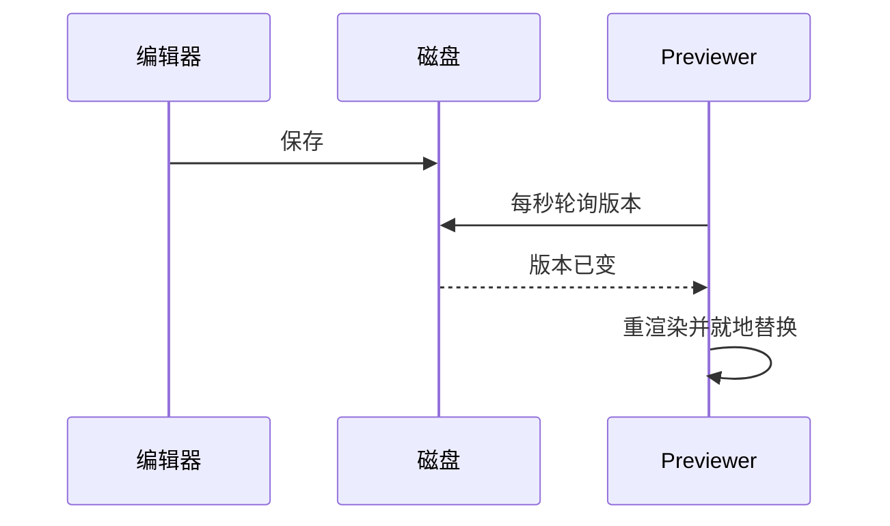

# 功能验收文档 Feature tour

这份文档把 Markdown Previewer 目前支持的每一种渲染和每一个交互都排了一遍。每节开头用一句话说明**该看什么**，看完就知道有没有坏。

> 需求来源：本文件自身即测试用例。
> 渲染引擎：cmark-gfm，扩展为 `table` / `strikethrough` / `tasklist`，脚注由 `CMARK_OPT_FOOTNOTES` 开启。
> 换行策略：单个换行即换行（`CMARK_OPT_HARDBREAKS`）。
>
> **这一段本身就是测试点**：上面四行在源文件里是四行独立的 `>`，如果它们被拼成一整段流水句，说明硬换行没生效。

---

## 一、标题层级

**该看什么**：H1 到 H6 应该一眼分得出层级；H4 及以下是「小号大写字距标签」，不是粗体正文。

### 1.1 三级标题

三级标题用来标一个步骤或子情形，字号比正文略大。

#### 1.1.1 四级标题

四级开始变成 tracked 大写标签。如果它看起来只是「粗一点的正文」，说明层级样式没生效。

##### 1.1.1.1 五级标题

五级和六级颜色更淡。

###### 1.1.1.1.1 六级标题

到此为止。

### 1.2 中英混排正文

Markdown Previewer 的正文用 Iowan Old Style 衬线，中文回落到宋体。这一段刻意写长一点，用来判断行高、字重和标点对齐：在 1280 宽的窗口下，英文大约每行 150 字符，中文大约每行 76 字 —— 这是你明确选择的「正文铺满全宽」策略，不是失控。检查点是「引号」、（全角括号）、破折号——以及分号；冒号：这些标点前后是否自然，中英切换处有没有挤在一起，比如 `inline code` 紧跟中文时的间距。

### 1.3 换行行为

**该看什么**：下面五行在源文件里是五行，渲染后也必须是**五行**。如果它们被拼成一整段，说明 `CMARK_OPT_HARDBREAKS` 没生效。

第一行：需求来源
第二行：改动范围
第三行：代码仓库
第四行：核实基线
第五行：负责人

而下面这两段之间隔着空行，所以它们是**两个段落**，段间距明显大于上面的行间距 —— 两者应该能一眼分开。

这是第一段。

这是第二段。

---

## 二、行内元素

**该看什么**：六种行内样式都要正确，且 `~~` 和 `[ ]` 不能在不该生效的地方生效。

**粗体**、*斜体*、***粗斜体***、~~删除线~~、`行内代码`、<kbd>⌘R</kbd>（这是原始 HTML，走 `CMARK_OPT_UNSAFE`）。

删除线包住行内代码：~~`deprecated_api.dart`~~ —— **这一个是重点**，旧实现在这里会失效，`~~` 会原样显示。

不该生效的情况：

- 行内代码里的波浪线 `a ~~b~~ c` 必须原样保留
- 不在列表开头的 `[ ]` 和 `[x]` 只是普通文字
- 转义的 \~\~ 不是删除线

链接：[显式链接](https://spec.commonmark.org/)、[跳到本文表格](#三表格)、[打开同目录另一个文件](./LinkedNote.md)。

裸 URL 保持纯文本：https://example.com/spec 与 www.example.dev。**这是刻意的** —— GFM 的 autolink 在中文里会把 URL 后面的标点和词一起吞掉，所以关掉了。

路径和代码引用也保持纯文本：`~/notes/docs/scope.md`、product_list_page.dart:631-638。

---

## 三、表格

**该看什么**：三种对齐生效；单元格内容能折行填满宽度而不是被裁掉；表头是小号大写标签而不是填充色带。

| 左对齐 | 居中 | 右对齐 | 说明（长文本折行） |
| :--- | :---: | ---: | --- |
| `windowCanvas` | 外层 | 1.5 | 暖米色画布，永不用纯白 |
| `sidebarSurface` | 凹陷 | 12.25 | 比画布深一档，保证相邻面可区分 |
| `panelSurface` | 抬起 | 340.5 | 承载文档纸张 |
| `accent` | 信号 | 8 | 赭石色，克制使用；这一格刻意写得很长，用来验证单元格会折行填满可用宽度，而不是把表格撑到需要横向滚动 |

### 3.1 需要横向滚动的宽表格

**该看什么**：列数多到折行也放不下时，表格会横向滚动。**已知限制**：滚动条是隐藏的（这是原本的设计决定），所以没有明显提示。

| 模块 | 客户端改动 | 实现口径 | 后端依赖 | 埋点 | 人日 | 状态 | 负责人 |
| --- | --- | --- | --- | --- | ---: | :---: | --- |
| `product_list` | 纯 UI 直改，全量放量 | 移植 `ItemSelector` 右下角楔形角标，删除旧 Radio 控件 | 无 | `list_item_click` | 1.0 | ✅ | A |
| `date_picker` | 复用 `shared_ui` 3.2.0，不 fork | Skip→Clear / start 前不置灰 / 区间气泡 / confirm 带天数 | 无 | `date_confirm` | 4.0 | ✅ | B |
| `detail_page` | BLoC 取组 + 3 个派生开关 | 组名映射 4 分支，`b1` 兜底 | `badge_text` 新字段 | `variant_exposure` | 2.5 | ⏳ | C |

---

## 四、列表

**该看什么**：三层缩进的项目符号形状不同；换行后的悬挂缩进对齐；紧凑列表和松散列表的间距不同。

- 第一层：项目符号是赭石色圆点
- 第二层前的一个长条目，写得足够长以便换行，检查第二行是否与第一行文字左边缘对齐，而不是缩回到符号下面
  - 第二层：空心圈
  - 第二层的另一项
    - 第三层：实心小方块
      - 第四层：继续缩进
- 回到第一层

有序列表：

1. 第一步
2. 第二步
   1. 嵌套的第一小步
   2. 嵌套的第二小步
3. 第三步

松散列表（条目之间有空行，每项被包进 `<p>`）：

- 松散项一，注意它和下一项之间的间距比紧凑列表大。

- 松散项二。

定义式的混合内容：

1. 带代码的条目：

   ```bash
   swift build -c release
   ```

2. 带引用的条目：

   > 列表里的引用块。

---

## 五、任务列表

**该看什么**：真实复选框（不是字面的 `[ ]`）；已完成项文字变灰、方框填赭石色带白勾；长条目换行后方框仍固定在第一行左侧。

- [ ] 未完成项
- [x] 已完成项
- [ ] 一个很长的未完成项，写到需要换行为止，用来确认复选框不会跟着文字跑到第二行去，也不会把后续行的缩进带歪，这一点在窄窗口下更容易暴露
  - [x] 嵌套的已完成项
  - [ ] 嵌套的未完成项
- [x] 已完成，且带 `行内代码` 和**粗体**

---

## 六、引用块

**该看什么**：暖砂底色、左上角引号字形、右边缘与正文对齐（不该短一截）。

> 单段引用。

> 多段引用的第一段。
>
> 第二段，用来看段间距。
>
> - 引用里的列表
> - 第二项

> 嵌套引用：
>
> > 里面这一层。

---

## 七、代码

**该看什么**：右上角语言标签；语法高亮；超长行横向滚动且右缘有暗色渐变提示；无语言标签的块不显示标签。

```swift
@MainActor
final class DocumentTab: ObservableObject, Identifiable {
    enum FileSyncStatus: Equatable {
        case upToDate
        case changedOnDisk
        case missingFromDisk
    }

    /// 磁盘上的文件与当前渲染内容是否已经不一致。
    var needsReloadPrompt: Bool {
        fileSyncStatus != .upToDate
    }
}
```

```javascript
function yieldToRenderer() {
  if (document.hidden) {
    return Promise.resolve();
  }
  return new Promise((resolve) => {
    window.requestAnimationFrame(resolve);
    window.setTimeout(resolve, 32);
  });
}
```

```css
li:has(> input[type="checkbox"]) {
  list-style: none;
}
```

```bash
swift test && ./scripts/build-app.sh release
```

```json
{ "autoReloadOnDiskChange": true }
```

```python
def slugify(text: str) -> str:
    return text.strip().lower().replace(" ", "-")
```

```sql
SELECT spm, count(*) FROM tracking WHERE event_name = 'page_view' GROUP BY spm;
```

```yaml
extensions:
  - table
  - strikethrough
  - tasklist
```

超长行（应横向滚动，右缘有暗色提示；上面已有 8 个代码块，足够触发高亮的分帧让出路径）：

```
2026-08-05T10:42:11.884Z  WARN  renderer  document exceeded soft budget: bytes=8421376 lines=93214 elapsed=412ms strategy=memory-mapped fallback=none extensions=table,strikethrough,tasklist
```

无语言标签的块（右上角不应有标签）：

```
plain text block
no language tag
```

---

## 八、图表

**该看什么**：Mermaid 用暖纸配色（米色节点、赭石连线），不是默认的灰蓝。




---

## 九、脚注

**该看什么**：正文里是上标数字；文末有独立脚注区（上方一条分隔线），每条末尾有回跳箭头 ↩，点击可以来回跳。

滚动保位用标题锚点[^anchor]，不是像素或比例[^ratio]。自动重载有一个针对半写文件的防护[^partial]。

[^anchor]: 顶部插入内容后标题会整体下移，但读者与标题的相对位置不变。实测插入 30 行后锚点下移 930px，滚动位置同步 +930，「进入该节 120px」保持不变。
[^ratio]: 文档长度一变就漂移。
[^partial]: 有些编辑器先截断再写，1 秒轮询可能撞上空文件那一瞬，所以「文件变空但上次渲染有内容」时跳过，等下一轮。

---

## 十、其它块级元素

**该看什么**：分隔线、图片圆角与描边。

分隔线上方。

---

分隔线下方。

图片（同目录下的 PNG，圆角 + 细描边）：


---

## 十一、边界情况

**该看什么**：这些都不应该崩、不应该串行。

围栏里的表格语法不该变成表格：

```md
| 这不是 | 表格 |
| --- | --- |
```

围栏里的删除线和任务列表也不该生效：

```text
~~不该有删除线~~
- [ ] 不该有复选框
```

HTML 实体：&amp; &lt; &gt; &copy; &mdash;

连续的空标记：`~~~~` 和 `****` 不应产生空元素。

很长的不可断英文单词：Supercalifragilisticexpialidociousandthensomemoretomakeitreallylong

---

## 十二、交互检查清单

文档渲染之外，这些要动手试：

| 操作 | 预期 |
| --- | --- |
| 点右侧大纲任意条目 | 跳到该节，**且高亮落在你点的那一项**（不是上一项） |
| 上下滚动文档 | 大纲高亮跟着走；滚到最底部时高亮最后一节 |
| 大纲的 ⌄ / › 按钮 | 全部展开 / 收起到前两级 |
| 在编辑器里改本文件并保存 | 预览**自动更新**，无白闪，阅读位置不跳 |
| 点工具栏闪电图标关掉自动重载后保存 | 变成标红提示，需按 ⌘R |
| `⌘R` | 重载所有有更新的文件（按钮上显示数量） |
| `⇧⌘R` | 无条件重载全部标签页 |
| `⌘Z` | 隐藏两侧边栏（zen 模式） |
| `⌘O` | 打开文件；已打开的文件会聚焦而不是重复打开 |
| `⌘W` | 关闭当前标签页 |
| 点上面第二节的「打开同目录另一个文件」 | 在新标签页打开 `LinkedNote.md` |
| 点「跳到本文表格」 | 页内锚点跳转 |
| 点显式外链 | 用系统默认浏览器打开 |
| 拖窄窗口 | 表格横向滚动，正文不溢出 |

---

## 十三、最后一节

**该看什么**：滚到文档最底部时，大纲里高亮的应该是**这一节**。这一节比视口矮，如果没有专门处理，它永远轮不到被高亮。

到此结束。
