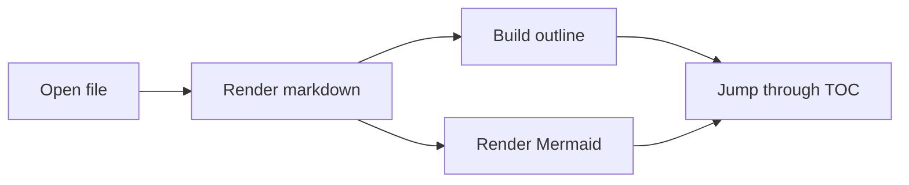

# Markdown Previewer demo

This file is here so you can immediately verify the app shell, heading outline, code blocks, and Mermaid rendering.

## Large-file posture

The previewer reads local files through a memory-mapped loader before handing the text to the renderer. That keeps startup responsive even when the note itself is large.

### A short list

- Files open into new tabs
- Opening the same file again focuses the existing tab
- The right sidebar is driven from document headings

## Mermaid

## Table example

| Area | What to check |
| --- | --- |
| Tabs | Existing files are focused instead of duplicated |
| Outline | Clicking headings scrolls the preview |
| Reload | `Reload` re-renders the selected file |

## Final heading

If you can see this in the outline, the TOC bridge is working.
